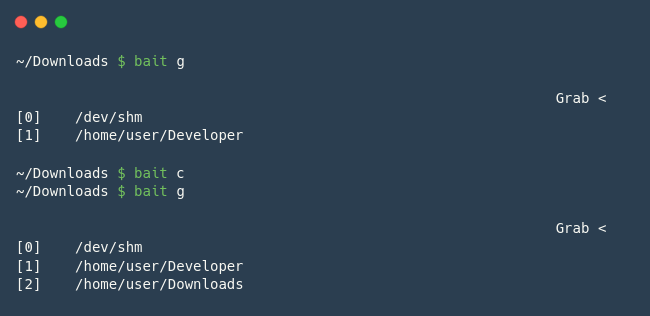
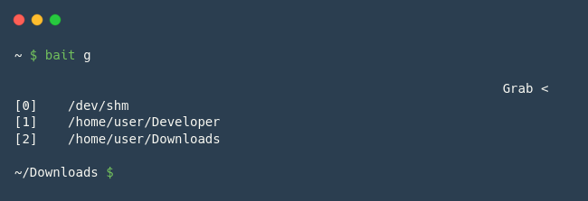
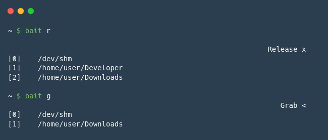

# BAIT 🪤

## The problem

Let's be honest... when using the terminal, there are just a handful of directories where we really do some work on.

Instead of typing, or looking at the history, for our last __cd__ command, why not _catch_ the most active directories in an easy and practical space?

Throw the _bait_ and catch the most used directories.

## Description

__Bait__ is a small CLI tool that _catches_ the current working directory every time you call the command.



You can review yours _catches_ and jump instantaneously to those directories.



The _catches_ are permanent and not tied to a specific session.

All entries can also be easily removed.



_* got some inspiration from [Harpoon](https://github.com/ThePrimeagen/harpoon)._

## Requirements

Linux, bash

Terminal type:

- xterm ...
- (maybe more, but not tested)

## Instalation 

Run the following command inside the src folder:

```sh
$ sudo make install
```

... afterwards, add this function to the _.bashrc_ file:

```sh
# I know that this is manhoso!
bait() {
  eval $(bait-tool $1 3>&1 1>&2 2>&3) 2> /dev/null
}
```

The better way to init the bait script is to run the __catch__ command.

By doing so, you will start by creating the file that will persist your data.


